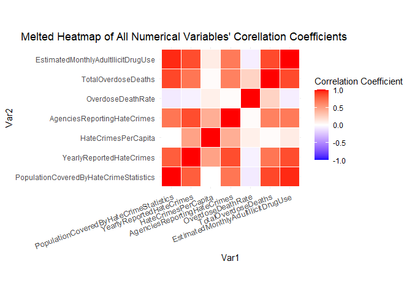
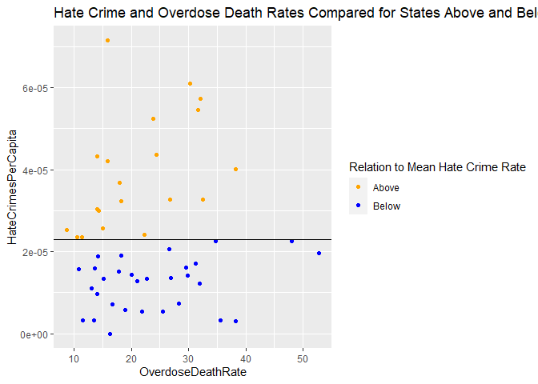
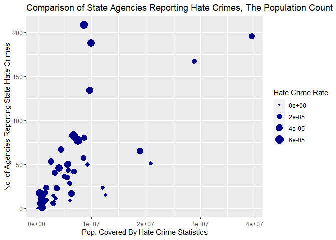
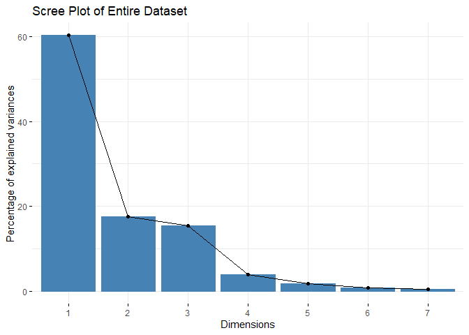
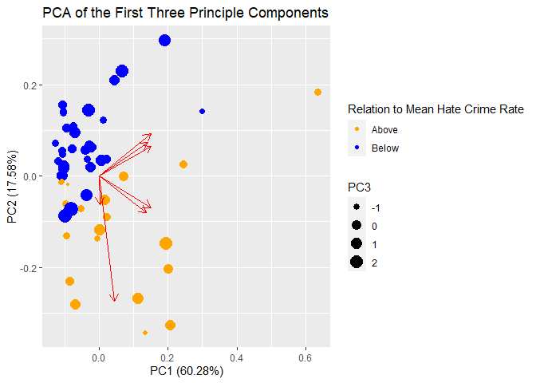

Project 1: Hate Crimes And Drug Abuse
================
Jared Tesar
3/19/2021

## Introduction

This project’s datasets come from the FBI’s 2019 hate crime data, the
CDC’s 2019 data on drug overdose deaths, and SAMHSA’s data on illicit
drug use. The variables contained within include hate crime report
counts by state, the count of agencies reporting hate crimes within each
state, the population that these agencies oversee, overdose deaths per
100,000 people per state, overdose deaths, and estimated ilicit drug use
by adults within a month in each state. Each dataset was obtained
through the public information on each organization’s website. I expect
to see an association between increased hate crimes and increase drug
use/overdoses. I also expect to see that the states with more agencies
reporting hate crimes will have more total reported hate crimes, as well
as larger populations covered in total by the agencies.

## Importing the Datasets

``` r
HateCrimes <- read_excel("C:/Users/Jared/Desktop/Homework/Comp Bio + Biostats/HateCrimes.xlsx")
#Specifies the first table included in the data set, as well as excluding the cells 
#allocated to describing the data.
DrugUse <- read_excel("C:/Users/Jared/Desktop/Homework/Comp Bio + Biostats/IlicitDrugs.xlsx", 
  sheet = 'Table 1', range = "A7:Q63")
DrugOverdose <- read_excel("C:/Users/Jared/Desktop/Homework/Comp Bio + Biostats/OverdoseDeaths.xlsx")
```

## Joining the Datasets

``` r
#Combines two of the three datasets, removing District of Columbia data 
#from the Hatecrime dataset with inner_join as it is missing from the overdose dataset
combined <- HateCrimes %>%
  inner_join(DrugOverdose)
```

    ## Joining, by = "State"

``` r
#Joins the first two with the entire third dataset while removing regional 
#information from the DrugUse dataset with inner_join
allThree <- inner_join(combined, DrugUse)
```

    ## Joining, by = "State"

``` r
#Selects the specific data vectors to be used.
final <- allThree %>%
  select('State', 'Population Covered', 'Number of Reported Hate Crimes', 
         'Agencies Submitting Hate Crime Reports', 'Overdose Death Rate', 
         'Total Overdose Deaths', 20)
#Renames variables with more context and succinctness.
final <- final %>%
  rename(
     EstimatedMonthlyAdultIlicitDrugUse = 7,
     YearlyReportedHateCrimes = 3,
     AgenciesReportingHateCrimes = 4,
     OverdoseDeathRate = 5,
     TotalOverdoseDeaths = 6,
     PopulationCoveredByHateCrimeStatistics = 2
  )
```

## Manipulating The Dataset

``` r
#Using Mutate to Find The Hate Crime Rate Per Capita
final <- final %>%
  mutate(HateCrimesPerCapita = YearlyReportedHateCrimes/PopulationCoveredByHateCrimeStatistics)


#Using Mutate to Create a categorical variable for States relation to the Mean Hate Crime Rate
final <- final %>%
  mutate(Hateful = case_when(HateCrimesPerCapita > mean(HateCrimesPerCapita) ~ 'Above',
                             HateCrimesPerCapita < mean(HateCrimesPerCapita) ~ 'Below'))

#Using Select and Arrange to Order by Reported Hate Crime Rate
final %>%
  select(State, HateCrimesPerCapita) %>%
  arrange(desc(HateCrimesPerCapita))
```

    ## # A tibble: 50 x 2
    ##    State         HateCrimesPerCapita
    ##    <chr>                       <dbl>
    ##  1 Washington              0.0000714
    ##  2 New Mexico              0.0000610
    ##  3 Massachusetts           0.0000573
    ##  4 New Jersey              0.0000546
    ##  5 Vermont                 0.0000525
    ##  6 Michigan                0.0000435
    ##  7 Oregon                  0.0000431
    ##  8 Hawaii                  0.0000421
    ##  9 Ohio                    0.0000402
    ## 10 Colorado                0.0000368
    ## # ... with 40 more rows

``` r
#Finding Many Statistics of Hate Crime Rates of All States Excluding Alabama
#The exclusion of Alabama was due to the lack of any hate crime reporting agencies, 
#causing a useless outlier.
HateCrimeStats <- final %>%
  filter(State != 'Alabama') %>%
  summarize(Data = 'Reported Hate Crimes',
            N = n(),
            Min = min(YearlyReportedHateCrimes),
            Max = max(YearlyReportedHateCrimes),
            Mean = mean(YearlyReportedHateCrimes),
            SD = sd(YearlyReportedHateCrimes),
            Variance = var(YearlyReportedHateCrimes)
            
            )
#Creating Table for All Numeric Statistics to Be Displayed In
allStats <- HateCrimeStats

#Adding the same hate crime per capita statistics but grouped for states above and below the 
#mean of reported hate crime rate.
allStats <- allStats %>%
  full_join(final %>%
              filter(State != 'Alabama') %>%
              group_by(Hateful) %>%
              summarize(Data = 'Grouped Reported Hate Crimes',
                N = n(),
                Min = min(YearlyReportedHateCrimes),
                Max = max(YearlyReportedHateCrimes),
                Mean = mean(YearlyReportedHateCrimes),
                SD = sd(YearlyReportedHateCrimes),
                Variance = var(YearlyReportedHateCrimes)
            
            ))
```

    ## Joining, by = c("Data", "N", "Min", "Max", "Mean", "SD", "Variance")

``` r
#Finding Many Statistics of The Reported Hate Crime Per Capita Data for each state Excluding Alabama
#The exclusion of Alabama was due to the lack of any hate crime reporting agencies, 
#causing a useless outlier.
HateCrimeCapitaStats <- final %>%
  filter(State != 'Alabama') %>%
  summarize(Data = 'Hate Crime Rate',
            N = n(),
            Min = min(HateCrimesPerCapita),
            Max = max(HateCrimesPerCapita),
            Mean = mean(HateCrimesPerCapita),
            SD = sd(HateCrimesPerCapita),
            Variance = var(HateCrimesPerCapita))

            

#Using full join to add the population statistics to the growing table of all numeric statstics
allStats <- allStats %>%
  full_join(HateCrimeCapitaStats)
```

    ## Joining, by = c("Data", "N", "Min", "Max", "Mean", "SD", "Variance")

``` r
#Adding the same hate crime per capita statistics but grouped for states above and below the 
#mean of reported hate crime rate.
allStats <- allStats %>%
  full_join(final %>%
              filter(State != 'Alabama') %>%
              group_by(Hateful) %>%
              summarize(Data = 'Grouped Hate Crime Rate',
                N = n(),
                Min = min(HateCrimesPerCapita),
                Max = max(HateCrimesPerCapita),
                Mean = mean(HateCrimesPerCapita),
                SD = sd(HateCrimesPerCapita),
                Variance = var(HateCrimesPerCapita)
            
            ))
```

    ## Joining, by = c("Data", "N", "Min", "Max", "Mean", "SD", "Variance", "Hateful")

``` r
#Finding Many Statistics of The Population Covered by Hate Crime Data for each state Excluding Alabama
#The exclusion of Alabama was due to the lack of any hate crime reporting agencies, 
#causing a useless outlier.
HateCrimePopStats <- final %>%
  filter(State != 'Alabama') %>%
  summarize(Data = 'Hate Crime Population Covered',
            N = n(),
            Min = min(PopulationCoveredByHateCrimeStatistics),
            Max = max(PopulationCoveredByHateCrimeStatistics),
            Mean = mean(PopulationCoveredByHateCrimeStatistics),
            SD = sd(PopulationCoveredByHateCrimeStatistics),
            Variance = var(PopulationCoveredByHateCrimeStatistics)
            )

#Using full join to add the population statistics to the growing table of all numeric statstics
allStats <- allStats %>%
  full_join(HateCrimePopStats)
```

    ## Joining, by = c("Data", "N", "Min", "Max", "Mean", "SD", "Variance")

``` r
#Adding the same hate crime population statistics but grouped for states above and below the 
#mean of reported hate crime rate.
allStats <- allStats %>%
  full_join(final %>%
              filter(State != 'Alabama') %>%
              group_by(Hateful) %>%
              summarize(Data = 'Grouped Hate Crime Population Covered',
                N = n(),
                Min = min(PopulationCoveredByHateCrimeStatistics),
                Max = max(PopulationCoveredByHateCrimeStatistics),
                Mean = mean(PopulationCoveredByHateCrimeStatistics),
                SD = sd(PopulationCoveredByHateCrimeStatistics),
                Variance = var(PopulationCoveredByHateCrimeStatistics)
            
            ))
```

    ## Joining, by = c("Data", "N", "Min", "Max", "Mean", "SD", "Variance", "Hateful")

``` r
#Finding Many Statistics of The Agencies Reporting Hate Crime Data for each state Excluding Alabama
#The exclusion of Alabama was due to the lack of any hate crime reporting agencies, 
#causing a useless outlier.
AgencyStats <- final %>%
  filter(State != 'Alabama') %>%
  summarize(Data = 'Agencies Reporting Hate Data',
            N = n(),
            Min = min(AgenciesReportingHateCrimes),
            Max = max(AgenciesReportingHateCrimes),
            Mean = mean(AgenciesReportingHateCrimes),
            SD = sd(AgenciesReportingHateCrimes),
            Variance = var(AgenciesReportingHateCrimes)
            )

#Using full join to add the agency statistics to the growing table of all numeric statstics
allStats <- allStats %>%
  full_join(AgencyStats)
```

    ## Joining, by = c("Data", "N", "Min", "Max", "Mean", "SD", "Variance")

``` r
#Adding the same hate crime agency statistics but grouped for states above and below the 
#mean of reported hate crime rate.
allStats <- allStats %>%
  full_join(final %>%
              filter(State != 'Alabama') %>%
              group_by(Hateful) %>%
              summarize(Data = 'Grouped Agencies Reporting Hate Data',
                N = n(),
                Min = min(AgenciesReportingHateCrimes),
                Max = max(AgenciesReportingHateCrimes),
                Mean = mean(AgenciesReportingHateCrimes),
                SD = sd(AgenciesReportingHateCrimes),
                Variance = var(AgenciesReportingHateCrimes)
            
            ))
```

    ## Joining, by = c("Data", "N", "Min", "Max", "Mean", "SD", "Variance", "Hateful")

``` r
#Finding Many Statistics of The Overdose Rate for each state.
OverdoseRateStats <- final %>%
  summarize(Data = 'Overdose Death Rates',
            N = n(),
            Min = min(OverdoseDeathRate),
            Max = max(OverdoseDeathRate),
            Mean = mean(OverdoseDeathRate),
            SD = sd(OverdoseDeathRate),
            Variance = var(OverdoseDeathRate))
            

#Using full join to add the overdose rate statistics to the growing table of all numeric statstics
allStats <- allStats %>%
  full_join(OverdoseRateStats)
```

    ## Joining, by = c("Data", "N", "Min", "Max", "Mean", "SD", "Variance")

``` r
#Adding the same overdose rate statistics but grouped for states above and below the 
#mean of reported hate crime rate.
allStats <- allStats %>%
  full_join(final %>%
              group_by(Hateful) %>%
              summarize(Data = 'Grouped Overdose Death Rates',
                N = n(),
                Min = min(OverdoseDeathRate),
                Max = max(OverdoseDeathRate),
                Mean = mean(OverdoseDeathRate),
                SD = sd(OverdoseDeathRate),
                Variance = var(OverdoseDeathRate)
            
            ))
```

    ## Joining, by = c("Data", "N", "Min", "Max", "Mean", "SD", "Variance", "Hateful")

``` r
#Finding Many Statistics of The Total Overdose Deaths for each state.
TotalOverdoseStats <- final %>%
  summarize(Data = 'Total Overdose Deaths',
            N = n(),
            Min = min(TotalOverdoseDeaths),
            Max = max(TotalOverdoseDeaths),
            Mean = mean(TotalOverdoseDeaths),
            SD = sd(TotalOverdoseDeaths),
            Variance = var(TotalOverdoseDeaths)
            )

#Using full join to add the total overdose death statistics to the growing table of all numeric statstics
allStats <- allStats %>%
  full_join(TotalOverdoseStats)
```

    ## Joining, by = c("Data", "N", "Min", "Max", "Mean", "SD", "Variance")

``` r
#Adding the same total overdose deaths statistics but grouped for states above and below the 
#mean of reported hate crime rate.
allStats <- allStats %>%
  full_join(final %>%
              group_by(Hateful) %>%
              summarize(Data = 'Grouped Total Overdose Deaths',
                N = n(),
                Min = min(TotalOverdoseDeaths),
                Max = max(TotalOverdoseDeaths),
                Mean = mean(TotalOverdoseDeaths),
                SD = sd(TotalOverdoseDeaths),
                Variance = var(TotalOverdoseDeaths)
            
            ))
```

    ## Joining, by = c("Data", "N", "Min", "Max", "Mean", "SD", "Variance", "Hateful")

``` r
#Finding Many Statistics of The estimated monthly adult ilicit drug use for each state.
DrugUseStats <- final %>%
  summarize(Data = 'Estimated Monthly Adult Ilicit Drug Use',
            N = n(),
            Min = min(EstimatedMonthlyAdultIlicitDrugUse),
            Max = max(EstimatedMonthlyAdultIlicitDrugUse),
            Mean = mean(EstimatedMonthlyAdultIlicitDrugUse),
            SD = sd(EstimatedMonthlyAdultIlicitDrugUse),
            Variance = var(EstimatedMonthlyAdultIlicitDrugUse)
            )

#Using full join to add the total overdose death statistics to the growing table of all numeric statstics
allStats <- allStats %>%
  full_join(DrugUseStats)
```

    ## Joining, by = c("Data", "N", "Min", "Max", "Mean", "SD", "Variance")

``` r
#Adding the same estimated adult illicit drug use each month
#statistics but grouped for states above and below the 
#mean of reported hate crime rate.
allStats <- allStats %>%
  full_join(final %>%
              group_by(Hateful) %>%
              summarize(Data = 'Estimated Monthly Adult Ilicit Drug Use Grouped',
                N = n(),
                Min = min(EstimatedMonthlyAdultIlicitDrugUse),
                Max = max(EstimatedMonthlyAdultIlicitDrugUse),
                Mean = mean(EstimatedMonthlyAdultIlicitDrugUse),
                SD = sd(EstimatedMonthlyAdultIlicitDrugUse),
                Variance = var(EstimatedMonthlyAdultIlicitDrugUse)
            
            ))
```

    ## Joining, by = c("Data", "N", "Min", "Max", "Mean", "SD", "Variance", "Hateful")

``` r
#Finished table containing all numerical statistics for each numeric variable
allStats
```

    ## # A tibble: 21 x 8
    ##    Data                       N     Min     Max    Mean      SD Variance Hateful
    ##    <chr>                  <int>   <dbl>   <dbl>   <dbl>   <dbl>    <dbl> <chr>  
    ##  1 Reported Hate Crimes      49 5   e+0 1.01e+3 1.42e+2 2.01e+2 4.05e+ 4 <NA>   
    ##  2 Grouped Reported Hate~    20 1.8 e+1 1.01e+3 2.56e+2 2.62e+2 6.84e+ 4 Above  
    ##  3 Grouped Reported Hate~    29 5   e+0 4.56e+2 6.37e+1 8.58e+1 7.35e+ 3 Below  
    ##  4 Hate Crime Rate           49 2.98e-6 7.14e-5 2.34e-5 1.66e-5 2.74e-10 <NA>   
    ##  5 Grouped Hate Crime Ra~    20 2.36e-5 7.14e-5 3.91e-5 1.39e-5 1.95e-10 Above  
    ##  6 Grouped Hate Crime Ra~    29 2.98e-6 2.26e-5 1.25e-5 6.08e-6 3.70e-11 Below  
    ##  7 Hate Crime Population~    49 5.13e+5 3.95e+7 6.21e+6 7.43e+6 5.52e+13 <NA>   
    ##  8 Grouped Hate Crime Po~    20 6.29e+5 3.95e+7 7.00e+6 8.92e+6 7.96e+13 Above  
    ##  9 Grouped Hate Crime Po~    29 5.13e+5 2.89e+7 5.67e+6 6.31e+6 3.98e+13 Below  
    ## 10 Agencies Reporting Ha~    49 1   e+0 2.08e+2 4.33e+1 5.16e+1 2.66e+ 3 <NA>   
    ## # ... with 11 more rows

``` r
#Using Group_by to find the mean drug overdose rate for each 'hateful' group
final %>%
  group_by(Hateful) %>%
  summarize(MeanOverdoses = mean(OverdoseDeathRate))
```

    ## # A tibble: 2 x 2
    ##   Hateful MeanOverdoses
    ##   <chr>           <dbl>
    ## 1 Above            20.9
    ## 2 Below            24.0

``` r
#Finding the correllation between the number of reported hate crimes per capita, 
#and the number of agencies that report them. Also Finding the correllation 
#between the number of reported hate crimes per capita and the estimated adult illicit drug use.
final %>%
  filter(State != 'Alabama') %>%
  summarize(HateCrimeToAgencyCorr = cor(HateCrimesPerCapita, AgenciesReportingHateCrimes),
                                        HateCrimeRateToAvgDrugUse = cor(HateCrimesPerCapita, 
                                        EstimatedMonthlyAdultIlicitDrugUse))
```

    ## # A tibble: 1 x 2
    ##   HateCrimeToAgencyCorr HateCrimeRateToAvgDrugUse
    ##                   <dbl>                     <dbl>
    ## 1                 0.403                    0.0922

``` r
#Creating a correlation matrix for all numeric variables in the dataset
corMat <- cor(final %>%
  select(PopulationCoveredByHateCrimeStatistics, YearlyReportedHateCrimes, HateCrimesPerCapita, 
          AgenciesReportingHateCrimes, OverdoseDeathRate, TotalOverdoseDeaths, 
         EstimatedMonthlyAdultIlicitDrugUse)
  )
meltedCorMat <- melt(round(corMat,2))
meltedCorMat
```

    ##                                      Var1
    ## 1  PopulationCoveredByHateCrimeStatistics
    ## 2                YearlyReportedHateCrimes
    ## 3                     HateCrimesPerCapita
    ## 4             AgenciesReportingHateCrimes
    ## 5                       OverdoseDeathRate
    ## 6                     TotalOverdoseDeaths
    ## 7      EstimatedMonthlyAdultIlicitDrugUse
    ## 8  PopulationCoveredByHateCrimeStatistics
    ## 9                YearlyReportedHateCrimes
    ## 10                    HateCrimesPerCapita
    ## 11            AgenciesReportingHateCrimes
    ## 12                      OverdoseDeathRate
    ## 13                    TotalOverdoseDeaths
    ## 14     EstimatedMonthlyAdultIlicitDrugUse
    ## 15 PopulationCoveredByHateCrimeStatistics
    ## 16               YearlyReportedHateCrimes
    ## 17                    HateCrimesPerCapita
    ## 18            AgenciesReportingHateCrimes
    ## 19                      OverdoseDeathRate
    ## 20                    TotalOverdoseDeaths
    ## 21     EstimatedMonthlyAdultIlicitDrugUse
    ## 22 PopulationCoveredByHateCrimeStatistics
    ## 23               YearlyReportedHateCrimes
    ## 24                    HateCrimesPerCapita
    ## 25            AgenciesReportingHateCrimes
    ## 26                      OverdoseDeathRate
    ## 27                    TotalOverdoseDeaths
    ## 28     EstimatedMonthlyAdultIlicitDrugUse
    ## 29 PopulationCoveredByHateCrimeStatistics
    ## 30               YearlyReportedHateCrimes
    ## 31                    HateCrimesPerCapita
    ## 32            AgenciesReportingHateCrimes
    ## 33                      OverdoseDeathRate
    ## 34                    TotalOverdoseDeaths
    ## 35     EstimatedMonthlyAdultIlicitDrugUse
    ## 36 PopulationCoveredByHateCrimeStatistics
    ## 37               YearlyReportedHateCrimes
    ## 38                    HateCrimesPerCapita
    ## 39            AgenciesReportingHateCrimes
    ## 40                      OverdoseDeathRate
    ## 41                    TotalOverdoseDeaths
    ## 42     EstimatedMonthlyAdultIlicitDrugUse
    ## 43 PopulationCoveredByHateCrimeStatistics
    ## 44               YearlyReportedHateCrimes
    ## 45                    HateCrimesPerCapita
    ## 46            AgenciesReportingHateCrimes
    ## 47                      OverdoseDeathRate
    ## 48                    TotalOverdoseDeaths
    ## 49     EstimatedMonthlyAdultIlicitDrugUse
    ##                                      Var2 value
    ## 1  PopulationCoveredByHateCrimeStatistics  1.00
    ## 2  PopulationCoveredByHateCrimeStatistics  0.79
    ## 3  PopulationCoveredByHateCrimeStatistics  0.00
    ## 4  PopulationCoveredByHateCrimeStatistics  0.69
    ## 5  PopulationCoveredByHateCrimeStatistics -0.09
    ## 6  PopulationCoveredByHateCrimeStatistics  0.87
    ## 7  PopulationCoveredByHateCrimeStatistics  0.95
    ## 8                YearlyReportedHateCrimes  0.79
    ## 9                YearlyReportedHateCrimes  1.00
    ## 10               YearlyReportedHateCrimes  0.48
    ## 11               YearlyReportedHateCrimes  0.85
    ## 12               YearlyReportedHateCrimes -0.06
    ## 13               YearlyReportedHateCrimes  0.69
    ## 14               YearlyReportedHateCrimes  0.85
    ## 15                    HateCrimesPerCapita  0.00
    ## 16                    HateCrimesPerCapita  0.48
    ## 17                    HateCrimesPerCapita  1.00
    ## 18                    HateCrimesPerCapita  0.42
    ## 19                    HateCrimesPerCapita  0.08
    ## 20                    HateCrimesPerCapita  0.02
    ## 21                    HateCrimesPerCapita  0.10
    ## 22            AgenciesReportingHateCrimes  0.69
    ## 23            AgenciesReportingHateCrimes  0.85
    ## 24            AgenciesReportingHateCrimes  0.42
    ## 25            AgenciesReportingHateCrimes  1.00
    ## 26            AgenciesReportingHateCrimes  0.02
    ## 27            AgenciesReportingHateCrimes  0.64
    ## 28            AgenciesReportingHateCrimes  0.67
    ## 29                      OverdoseDeathRate -0.09
    ## 30                      OverdoseDeathRate -0.06
    ## 31                      OverdoseDeathRate  0.08
    ## 32                      OverdoseDeathRate  0.02
    ## 33                      OverdoseDeathRate  1.00
    ## 34                      OverdoseDeathRate  0.23
    ## 35                      OverdoseDeathRate -0.07
    ## 36                    TotalOverdoseDeaths  0.87
    ## 37                    TotalOverdoseDeaths  0.69
    ## 38                    TotalOverdoseDeaths  0.02
    ## 39                    TotalOverdoseDeaths  0.64
    ## 40                    TotalOverdoseDeaths  0.23
    ## 41                    TotalOverdoseDeaths  1.00
    ## 42                    TotalOverdoseDeaths  0.86
    ## 43     EstimatedMonthlyAdultIlicitDrugUse  0.95
    ## 44     EstimatedMonthlyAdultIlicitDrugUse  0.85
    ## 45     EstimatedMonthlyAdultIlicitDrugUse  0.10
    ## 46     EstimatedMonthlyAdultIlicitDrugUse  0.67
    ## 47     EstimatedMonthlyAdultIlicitDrugUse -0.07
    ## 48     EstimatedMonthlyAdultIlicitDrugUse  0.86
    ## 49     EstimatedMonthlyAdultIlicitDrugUse  1.00

## Data Visualizations

``` r
#A correlation heatmap of all numeric variables included in the dataset, ranging from -1 to 1.
ggplot(data=meltedCorMat, aes(x=Var1, y=Var2, fill=value)) + geom_tile(color = 'white') +
  scale_fill_gradient2(low = 'blue', high = 'red', mid = 'white', midpoint = 0, limit = c(-1, 1), space = 'Lab',
                       name='Correlation Coefficient') + theme_minimal() +
  theme(axis.text.x = element_text(angle = 20, vjust = 1, size = 10, hjust = 1)) + coord_fixed() +
  labs(title = 'Melted Heatmap of All Numerical Variables\' Corellation Coefficients') +
  theme(plot.title = element_text(hjust = .75))
```

<!-- -->

``` r
#A scatterplot comparing the relationship between Overdose Death rate and hate crimes per capita for states above and below the average hate crime rate.
ggplot(data=final, aes(x=OverdoseDeathRate, y=HateCrimesPerCapita, color=Hateful)) +
geom_point() + labs(title = 'Hate Crime and Overdose Death Rates Compared for States Above and Below the Mean Hate Crime Rate',
     color= 'Relation to Mean Hate Crime Rate') + 
  geom_hline(yintercept = mean(final$HateCrimesPerCapita))  + scale_color_manual(values=c('Orange', 'Blue'))
```

<!-- -->

``` r
#A scatterplot relating the number of state agencies reporting hate crimes, the population covered by these agencies, and the hate crime reports per capita.
ggplot(data=final, aes(x = PopulationCoveredByHateCrimeStatistics, 
                       y = AgenciesReportingHateCrimes, size=HateCrimesPerCapita)) +
  geom_point(color = 'DarkBlue') + 
  labs(title = 'Comparison of State Agencies Reporting Hate Crimes, The Population Count Covered By These Statistics, and The Hate Crime Report Rate Per Capita',
       x = 'Pop. Covered By Hate Crime Statistics',
       y='No. of Agencies Reporting State Hate Crimes',
       size= 'Hate Crime Rate')
```

<!-- -->
\#\# Principal Component Analysis

``` r
#Conducting a PCA of the numerical variables in the entire dataset, each value normalized
finalPCA <- prcomp(final %>%
         select(-c(State, Hateful)), scale = TRUE)

#Creation of a Scree Plot to find the number of principal components
fviz_eig(finalPCA) + labs(title = 'Scree Plot of Entire Dataset')
```

<!-- -->

``` r
#The last, large difference between Percent of Explained Variance occurs beteween the third and 
#fouth principle comonents, so three principle components will be selected.

#Plots the first three principal components
autoplot(finalPCA, data = final, colour = 'Hateful', size='PC3', loadings = TRUE) + 
  labs(title = 'PCA of the First Three Principle Components', 
       colour = 'Relation to Mean Hate Crime Rate') +
  scale_color_manual(values = c('Orange','Blue'))
```

    ## Warning: `select_()` was deprecated in dplyr 0.7.0.
    ## Please use `select()` instead.

<!-- -->

``` r
write.csv(final,"C:\\Users\\Jared\\Desktop\\Homework\\Comp Bio + Biostats\\Project2Data.csv", row.names = TRUE)
```
