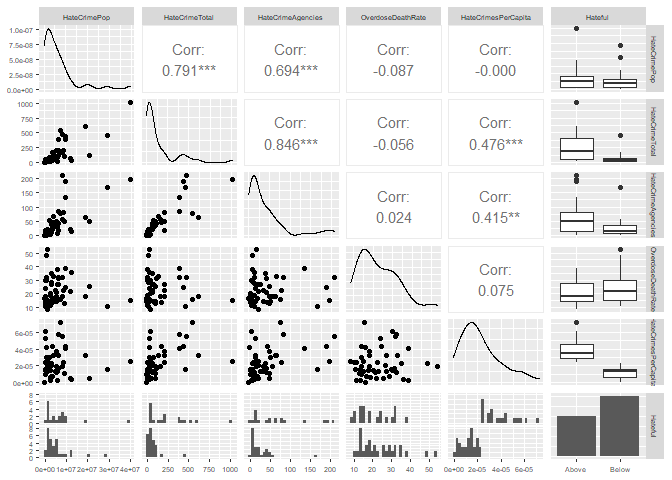
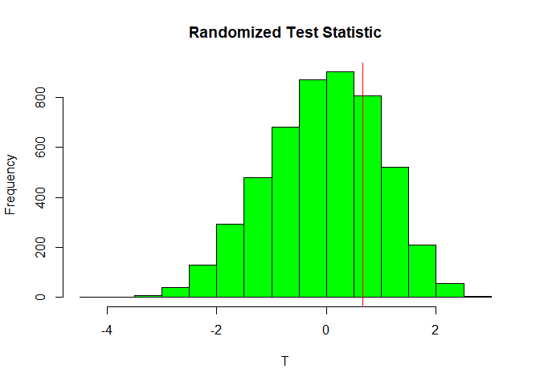
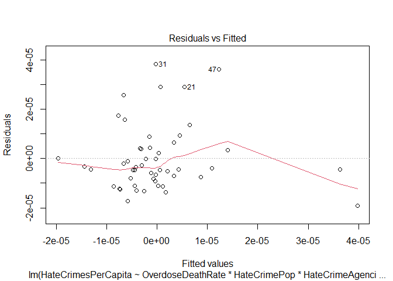
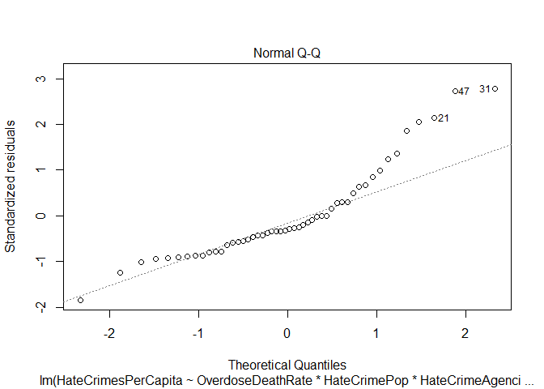
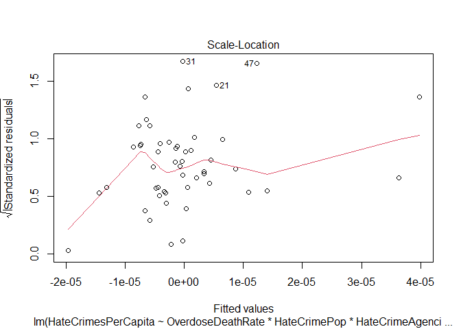
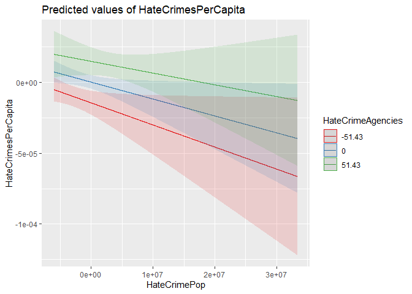
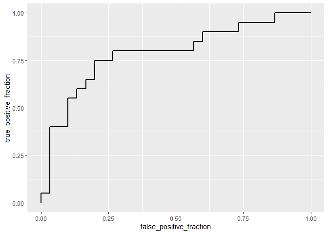

Modeling of Federal Hate Crime and Drug Abuse Data
================
Jared Tesar
4/17/2021

## Introduction

The data used in this project comes from the Federal Bureau of
Investiation’s 2019 data on hate crimes committed within each state, and
the Centers for Disease Control and Prevention’s 2019 data on drug
overdose mortality within each state, each containing one observation
per state . The variables obtained from the FBI consists of the number
of state agencies reporting hate crimes within a state,
‘AgenciesReportingHateCrimes’, the number of these reported hate crimes,
‘YearlyReportedHateCrimes’, and the population that was covered by the
agencies responsible for reporting the hate crimes,
‘PopulationCoveredByHateCrimeStatistics’. In a past project, I used this
data to create two new variables: ‘HateCrimesPerCapita’, the number of
hate crimes per person covered by the hate crime agencies, and
‘Hateful’, a categorical variable representing whether or not the state
has above average hate crimes per capita. This data has gone through
multiple rounds of tidying to adequately combine the data from the two
sources. I am excited to continue using this data, as previous tests
found no correlation between drug use statistics and hate crime
statistics, which surprised me. I’m hoping to use more rigorous testing
to prove or disprove the previous testing.

``` r
#Importing data from my excel document and taking a peek at it
Project2Data <- read_excel("C:/Users/Jared/Desktop/Homework/Comp Bio + Biostats/Project2Data.xlsx")
head(Project2Data)
```

    ## # A tibble: 6 x 7
    ##   State  PopulationCoveredB~ YearlyReportedH~ AgenciesReportin~ OverdoseDeathRa~
    ##   <chr>                <dbl>            <dbl>             <dbl>            <dbl>
    ## 1 Alaba~               85670                0                 0             16.3
    ## 2 Alaska              727792               11                 5             17.8
    ## 3 Arizo~             6395924              209                17             26.8
    ## 4 Arkan~             2813597                9                 6             13.5
    ## 5 Calif~            39502561             1015               195             15  
    ## 6 Color~             5705335              210                50             18  
    ## # ... with 2 more variables: HateCrimesPerCapita <dbl>, Hateful <chr>

## Variable Renaming

Many of the variables have long, overly descriptive names. This code
renames them to smaller versions of themselves.
‘PopulationCoveredByHateCrimeStatistics’ became ‘HateCrimePop’,
‘YearlyReportedHateCrimes’ became ‘HateCrimeTotal’, and
‘AgenciesReportingHateCrimes’ became ‘HateCrimeAgencies’.

``` r
#Renaming variables
Project2Data <- Project2Data %>%
  rename(HateCrimePop = 2,
         HateCrimeTotal = 3,
         HateCrimeAgencies = 4)
#Taking a peek at the new, renamed variables
head(Project2Data)
```

    ## # A tibble: 6 x 7
    ##   State      HateCrimePop HateCrimeTotal HateCrimeAgencies OverdoseDeathRate
    ##   <chr>             <dbl>          <dbl>             <dbl>             <dbl>
    ## 1 Alabama           85670              0                 0              16.3
    ## 2 Alaska           727792             11                 5              17.8
    ## 3 Arizona         6395924            209                17              26.8
    ## 4 Arkansas        2813597              9                 6              13.5
    ## 5 California     39502561           1015               195              15  
    ## 6 Colorado        5705335            210                50              18  
    ## # ... with 2 more variables: HateCrimesPerCapita <dbl>, Hateful <chr>

## Main Variable Univariate and Bivariate Tests

The main variables under scrutiny in this project are
HateCrimesPerCapita and OverdoseDeathRate, the two variables that take
into account their state’s population while giving insight into their
respective statistics, hate crimes and drug use. Below we will see a
figure containing univariate distributions and bivariate corellation
coefficients.

``` r
#Creating a scatterplot matrix containing the scatterplot of every combination of 2 variables, the frequency histogram of each individual numeric variable, and the correlation coefficient between each variable. Additionally, it contains the boxplots of each variable when grouped by the 'Hateful' categorical variable.
ggpairs(Project2Data %>%
          select(2:7)) +  theme(text = element_text(size = 7))
```

    ## `stat_bin()` using `bins = 30`. Pick better value with `binwidth`.
    ## `stat_bin()` using `bins = 30`. Pick better value with `binwidth`.
    ## `stat_bin()` using `bins = 30`. Pick better value with `binwidth`.
    ## `stat_bin()` using `bins = 30`. Pick better value with `binwidth`.
    ## `stat_bin()` using `bins = 30`. Pick better value with `binwidth`.


Many of these correlation coefficients are easiliy explained. The high
correlation between HateCrimeAgencies and HateCrimeTotal, for example,
is readily apparent in that the more agencies reporting hate crimes, the
more hate crimes will be reported. A more interesting substantial
correlation coefficient would be the 0.415 between HateCrimesPerCapita
and HateCrimeAgencies. The more agencies tasked with reporting hate
crimes, the more hate crimes were found per person under the scrutiny of
those agencies. However, this too can be explained at least partially by
the idea that agencies are likely placed in areas that need them to be
there, due to high perceived hate crimes prior to the agency’s
installation. Looking at the univariate graphs down the diagonal, little
hope remains for the assumption of normality that will be assumed in
future tests.

## MANOVA Testing

We use a MANOVA test to compare all the means of each numeric, dependant
variable while grouping the data by a categorical variable. In this
case, every numeric variable, excepting HateCrimesPerCapita, was tested
against the category of ‘Hateful’, which describes whether or not a
given state had an above average hate crime rate per capita in 2019. The
MANOVA returned a very small test statistic, indicating a significant
difference between group means. Therefore, it became necessary to use
further tests to determine which means were significantly differing. The
first of these extra tests were univariate ANOVA’s for each numerical
variable, grouped by ‘Hateful’. Of these four ANOVAs, those that
returned a test statistic indicated a significance in difference between
the means included HateCrimeAgencies and HateCrimeTotal. These two
variables had the highest correlation coefficients with
HateCrimePerCapita, which was mutated to create ‘Hateful’, so it makes
sense that they would have a difference in means when grouped by
‘Hateful’. Next, post-hoc t-tests were performed, which serve a similar
purpose to the four ANOVAs by finding which dependant variables have
significantly different means, but incurs a larger Type 1 error. ANOVA’s
take only a 5% type 1 error. Post-hoc t-tests are unnecessary in this
situation, since the categorical variable used only has two categories,
so any significant mean difference found would be the only possible
difference, between the ‘Above’ and ‘Below’ categories. MANOVA and ANOVA
tests assume normality, which does not appear likely in our data.

``` r
#Performing the MANOVA test with all the numeric variables compared to the grouping variable of 'Hateful'.
manova <- manova(cbind(Project2Data$HateCrimePop, Project2Data$HateCrimeTotal, Project2Data$HateCrimeAgencies, Project2Data$OverdoseDeathRate) ~ Hateful, data= Project2Data)
summary(manova)
```

    ##           Df  Pillai approx F num Df den Df    Pr(>F)    
    ## Hateful    1 0.46675   9.8471      4     45 8.254e-06 ***
    ## Residuals 48                                             
    ## ---
    ## Signif. codes:  0 '***' 0.001 '**' 0.01 '*' 0.05 '.' 0.1 ' ' 1

``` r
#Performing an ANOVA for each of the numeric variables and whether or not the state has above average hate crime per capita
anovaAll <- aov(cbind(Project2Data$HateCrimePop, Project2Data$HateCrimeTotal, Project2Data$HateCrimeAgencies, Project2Data$OverdoseDeathRate) ~ Hateful, data = Project2Data)
summary(anovaAll)
```

    ##  Response 1 :
    ##             Df     Sum Sq    Mean Sq F value Pr(>F)
    ## Hateful      1 2.7574e+13 2.7574e+13   0.498 0.4838
    ## Residuals   48 2.6579e+15 5.5373e+13               
    ## 
    ##  Response 2 :
    ##             Df  Sum Sq Mean Sq F value    Pr(>F)    
    ## Hateful      1  453885  453885  14.433 0.0004089 ***
    ## Residuals   48 1509494   31448                      
    ## ---
    ## Signif. codes:  0 '***' 0.001 '**' 0.01 '*' 0.05 '.' 0.1 ' ' 1
    ## 
    ##  Response 3 :
    ##             Df Sum Sq Mean Sq F value   Pr(>F)   
    ## Hateful      1  21017 21017.1  9.2887 0.003743 **
    ## Residuals   48 108607  2262.7                    
    ## ---
    ## Signif. codes:  0 '***' 0.001 '**' 0.01 '*' 0.05 '.' 0.1 ' ' 1
    ## 
    ##  Response 4 :
    ##             Df Sum Sq Mean Sq F value Pr(>F)
    ## Hateful      1  112.6 112.608  1.1593  0.287
    ## Residuals   48 4662.6  97.138

``` r
#Responses 2 and 3, corresponding to the variables HateCrimeTotal and HateCrimeAgencies, respectively, returned statistically significant differences in means.
```

## Randomization Testing

Randomization tests are used to resample data from the originial dataset
to randomize which datapoint is assigned to which group, to test if
randomly generated groups could create a test statistic as significant
as the original groups. The variable chosen for randomization testing is
HateCrimePop, since the impact of population size on hate crime rate is
interesting to me.

``` r
#Randomization Test of HateCrimePop
##Finding the original test statistic for the actual grouped data
populationValues <- Project2Data$HateCrimePop
groups <- Project2Data$Hateful
t.test(populationValues ~ groups)
```

    ## 
    ##  Welch Two Sample t-test
    ## 
    ## data:  populationValues by groups
    ## t = 0.65869, df = 31.404, p-value = 0.5149
    ## alternative hypothesis: true difference in means is not equal to 0
    ## 95 percent confidence interval:
    ##  -3175326  6207061
    ## sample estimates:
    ## mean in group Above mean in group Below 
    ##             7001090             5485223

``` r
realTestStat <- t.test(populationValues ~ groups)$statistic

##Resampling many randomized variations of the data and saving their test statistics
N <- 5000
statistics <- rep(0, N)
for(i in 1:N){
  newGroup <- sample(groups, length(groups), replace=FALSE)
  Ttest1 <- t.test(populationValues ~ newGroup)
  statistics[i] <- Ttest1$statistic
}
#Creating a histogram of the test statistics from random samples
hist(statistics, col = 'green',
     main = 'Randomized Test Statistic',
     xlab = 'T')
abline(v = realTestStat, col = 'red')
```

<!-- -->

The histogram represents all the test statistics found from completely
random assignments of the ‘Hateful’ groups to each state, and the red
verticle line represents the true test statistic found from our
univariate ANOVA. From this visual, we can clearly see a high likelihood
of finding a similar test statistic with a completely random choosing of
the data. The null hypothesis of this test is that our true statistic
from our ANOVA is not significantly different from a test statistic
derived from entirely random group assignments. The alternative
hypothesis would be that the randomized groups cannot consistently
generate a test statistic similar to our ANOVA. In this case, the null
hypothesis cannot be rejected.

## Linear Regression Model

``` r
#Creating a new dataset with the same variables, but the numeric ones have been centered around their means
Project2DataCentered <- Project2Data %>%
  mutate_at(2:6, function(x)x-mean(x))%>%
  mutate(Y = ifelse(Hateful == 'Above', 1, 0))
#Creating a linear regression model that accounts for the variables OverdoseDeathRate, HateCrimePop, HateCrimeAgencies, and their interactions, as compared to their hate crimes per capita.
fit1 <- lm(HateCrimesPerCapita ~ OverdoseDeathRate * HateCrimePop * HateCrimeAgencies , data = Project2DataCentered)
summary(fit1)
```

    ## 
    ## Call:
    ## lm(formula = HateCrimesPerCapita ~ OverdoseDeathRate * HateCrimePop * 
    ##     HateCrimeAgencies, data = Project2DataCentered)
    ## 
    ## Residuals:
    ##        Min         1Q     Median         3Q        Max 
    ## -1.913e-05 -8.068e-06 -4.127e-06  3.986e-06  3.830e-05 
    ## 
    ## Coefficients:
    ##                                                    Estimate Std. Error t value
    ## (Intercept)                                       2.599e-07  2.424e-06   0.107
    ## OverdoseDeathRate                                -2.767e-07  3.149e-07  -0.879
    ## HateCrimePop                                     -1.192e-12  5.738e-13  -2.078
    ## HateCrimeAgencies                                 2.853e-07  7.792e-08   3.662
    ## OverdoseDeathRate:HateCrimePop                    3.727e-15  8.035e-14   0.046
    ## OverdoseDeathRate:HateCrimeAgencies              -9.405e-09  1.030e-08  -0.913
    ## HateCrimePop:HateCrimeAgencies                    7.092e-15  1.004e-14   0.706
    ## OverdoseDeathRate:HateCrimePop:HateCrimeAgencies  1.364e-15  1.205e-15   1.132
    ##                                                  Pr(>|t|)    
    ## (Intercept)                                      0.915134    
    ## OverdoseDeathRate                                0.384635    
    ## HateCrimePop                                     0.043845 *  
    ## HateCrimeAgencies                                0.000695 ***
    ## OverdoseDeathRate:HateCrimePop                   0.963222    
    ## OverdoseDeathRate:HateCrimeAgencies              0.366623    
    ## HateCrimePop:HateCrimeAgencies                   0.484089    
    ## OverdoseDeathRate:HateCrimePop:HateCrimeAgencies 0.263887    
    ## ---
    ## Signif. codes:  0 '***' 0.001 '**' 0.01 '*' 0.05 '.' 0.1 ' ' 1
    ## 
    ## Residual standard error: 1.442e-05 on 42 degrees of freedom
    ## Multiple R-squared:  0.3619, Adjusted R-squared:  0.2555 
    ## F-statistic: 3.402 on 7 and 42 DF,  p-value: 0.005728

``` r
#Create multiple diagnostic plots for assumption testing
plot(fit1)
```

<!-- --><!-- --><!-- --><!-- -->

``` r
#Create a plot for the interaction term between HateCrimePop and HateCrimeAgencies on HateCrimesPerCapita
plot_model(fit1, type = "pred", terms = c("HateCrimePop", "HateCrimeAgencies"))
```

<!-- -->

The coefficients returned by this linear regression model represent the
impact of the explanatory variable upon the dependant variable, which,
in this case, is HateCrimesPerCapita, centered around the mean. That
means that for each increase of 1 in the explanatory variable, the
predicted number of HateCrimesPerCapita increases by the coefficient
corresponding to that explanatory variable. Regardless of significance,
the variable coefficients range from small, to very very small.
OverdoseDeathRate increasing by 1 increases HateCrimePerCapita by
-0.0000002767. HateCrimePop has a significant impact of
-.000000000001192. HateCrimeAgencies, the only other coefficient with a
significant p-value, has an impact of .0000002853. The interaction
coefficients represent the impact of one explanatory variable on
another. For example, as OverdoseDeathRate increases by 1, HateCrimePop
increases by 000000000000000.3727. Its impact on HateCrimeAgencies is
-0.000000009405. Finally, its impact on the interaction between
HateCrimePop and HateCrimeAgencies is 0.000000000000001364. The final
interraction term, that of HateCrimePop and HateCrimeAgencies is
0.0000000000000007092. None of these interaction terms were found to be
significant, surprising me. The adjusted R-squared value, a measurement
of the proportion of variation in the dependent variable explained by
the explanatory variable, equals 0.2555, or about a quarter of the total
variation. The final graph shows how little impact the interaction term
between HateCrimePop and HateCrimeAgencies there truly is.

#### Assumptions

The Q-Q plot above shows a deviation from a Q-Q plot of normalized data,
especially towards the greater theoretical quantiles. It isn’t
incredibly deviate, but it does enough to show the data is not normal,
and the assumption of normality is not completely upheld. In the
residuals vs filled plot, we can see an unstable red line, representing
a lack of linearity of the data. The residuals are not constant
throughout the fitted values whatsoever, so the variance of the values
is not constant.

#### Post-Assumption Linear Regressions

``` r
#Performing the linear regression with robust standard error.
coeftest(fit1, vcov = vcovHC(fit1, type = 'HC1'))
```

    ## 
    ## t test of coefficients:
    ## 
    ##                                                     Estimate  Std. Error
    ## (Intercept)                                       2.5986e-07  2.4360e-06
    ## OverdoseDeathRate                                -2.7669e-07  3.1833e-07
    ## HateCrimePop                                     -1.1924e-12  4.9321e-13
    ## HateCrimeAgencies                                 2.8535e-07  9.7642e-08
    ## OverdoseDeathRate:HateCrimePop                    3.7270e-15  6.3145e-14
    ## OverdoseDeathRate:HateCrimeAgencies              -9.4046e-09  1.1833e-08
    ## HateCrimePop:HateCrimeAgencies                    7.0919e-15  8.2916e-15
    ## OverdoseDeathRate:HateCrimePop:HateCrimeAgencies  1.3641e-15  1.1417e-15
    ##                                                  t value Pr(>|t|)   
    ## (Intercept)                                       0.1067 0.915555   
    ## OverdoseDeathRate                                -0.8692 0.389685   
    ## HateCrimePop                                     -2.4176 0.020040 * 
    ## HateCrimeAgencies                                 2.9224 0.005572 **
    ## OverdoseDeathRate:HateCrimePop                    0.0590 0.953214   
    ## OverdoseDeathRate:HateCrimeAgencies              -0.7948 0.431216   
    ## HateCrimePop:HateCrimeAgencies                    0.8553 0.397229   
    ## OverdoseDeathRate:HateCrimePop:HateCrimeAgencies  1.1948 0.238872   
    ## ---
    ## Signif. codes:  0 '***' 0.001 '**' 0.01 '*' 0.05 '.' 0.1 ' ' 1

After recomputing the linear regression model, this time with robust
standard error, the same variables are significant, HateCrimePop and
HateCrimeAgencies, but they are less so, with greater p-values. Other
than this and slight alterations in the coefficients, although the all
remain very small numbers, there are no changes. Next, bootstrapped
standard errors will be created for use in the linear regression model.

``` r
#Writing function to grab bootstrapped standard error of a given data vector
bootSE <- function(x, n=5000){
  means <- vector()
  
  for(i in 1:n){
    means[i] <- mean(sample(x, replace = TRUE))
  }
  return(sd(means))
}

booted <- Project2DataCentered %>%
  group_by(Hateful) %>%
  summarize(MeanOverdose = mean(OverdoseDeathRate),
            se = bootSE(OverdoseDeathRate),
            MeanPop = mean(HateCrimePop),
            se = bootSE(HateCrimePop),
            MeanAgencies = mean(HateCrimeAgencies),
            se = bootSE(HateCrimeAgencies))
booted
```

    ## # A tibble: 2 x 5
    ##   Hateful MeanOverdose    se  MeanPop MeanAgencies
    ##   <chr>          <dbl> <dbl>    <dbl>        <dbl>
    ## 1 Above          -1.84 14.4   909521.         25.1
    ## 2 Below           1.23  5.55 -606347.        -16.7

``` r
summary(fit1, robust = T)
```

    ## 
    ## Call:
    ## lm(formula = HateCrimesPerCapita ~ OverdoseDeathRate * HateCrimePop * 
    ##     HateCrimeAgencies, data = Project2DataCentered)
    ## 
    ## Residuals:
    ##        Min         1Q     Median         3Q        Max 
    ## -1.913e-05 -8.068e-06 -4.127e-06  3.986e-06  3.830e-05 
    ## 
    ## Coefficients:
    ##                                                    Estimate Std. Error t value
    ## (Intercept)                                       2.599e-07  2.424e-06   0.107
    ## OverdoseDeathRate                                -2.767e-07  3.149e-07  -0.879
    ## HateCrimePop                                     -1.192e-12  5.738e-13  -2.078
    ## HateCrimeAgencies                                 2.853e-07  7.792e-08   3.662
    ## OverdoseDeathRate:HateCrimePop                    3.727e-15  8.035e-14   0.046
    ## OverdoseDeathRate:HateCrimeAgencies              -9.405e-09  1.030e-08  -0.913
    ## HateCrimePop:HateCrimeAgencies                    7.092e-15  1.004e-14   0.706
    ## OverdoseDeathRate:HateCrimePop:HateCrimeAgencies  1.364e-15  1.205e-15   1.132
    ##                                                  Pr(>|t|)    
    ## (Intercept)                                      0.915134    
    ## OverdoseDeathRate                                0.384635    
    ## HateCrimePop                                     0.043845 *  
    ## HateCrimeAgencies                                0.000695 ***
    ## OverdoseDeathRate:HateCrimePop                   0.963222    
    ## OverdoseDeathRate:HateCrimeAgencies              0.366623    
    ## HateCrimePop:HateCrimeAgencies                   0.484089    
    ## OverdoseDeathRate:HateCrimePop:HateCrimeAgencies 0.263887    
    ## ---
    ## Signif. codes:  0 '***' 0.001 '**' 0.01 '*' 0.05 '.' 0.1 ' ' 1
    ## 
    ## Residual standard error: 1.442e-05 on 42 degrees of freedom
    ## Multiple R-squared:  0.3619, Adjusted R-squared:  0.2555 
    ## F-statistic: 3.402 on 7 and 42 DF,  p-value: 0.005728

## Logistic Regression

``` r
#Create logistic regression model between two predictor variables HateCrimeAgencies and OverdoseDeathRate and whether or not the state has above average hate crimes per capita
fit2 <- glm(Y ~ OverdoseDeathRate + HateCrimeAgencies, data = Project2DataCentered, family = 'binomial')
summary(fit2)
```

    ## 
    ## Call:
    ## glm(formula = Y ~ OverdoseDeathRate + HateCrimeAgencies, family = "binomial", 
    ##     data = Project2DataCentered)
    ## 
    ## Deviance Residuals: 
    ##     Min       1Q   Median       3Q      Max  
    ## -2.4323  -0.8684  -0.6505   1.0684   1.8629  
    ## 
    ## Coefficients:
    ##                    Estimate Std. Error z value Pr(>|z|)  
    ## (Intercept)       -0.389141   0.329971  -1.179   0.2383  
    ## OverdoseDeathRate -0.047490   0.037801  -1.256   0.2090  
    ## HateCrimeAgencies  0.021892   0.009262   2.364   0.0181 *
    ## ---
    ## Signif. codes:  0 '***' 0.001 '**' 0.01 '*' 0.05 '.' 0.1 ' ' 1
    ## 
    ## (Dispersion parameter for binomial family taken to be 1)
    ## 
    ##     Null deviance: 67.301  on 49  degrees of freedom
    ## Residual deviance: 56.752  on 47  degrees of freedom
    ## AIC: 62.752
    ## 
    ## Number of Fisher Scoring iterations: 4

``` r
#Finding the coefficient's exponential values, representing the odds of each variable.
exp(coef(fit2))
```

    ##       (Intercept) OverdoseDeathRate HateCrimeAgencies 
    ##         0.6776388         0.9536204         1.0221334

``` r
#Created a value predicting the hateful status of a state
Project2DataCentered$Prediction <- predict(fit2, type='response')

#Assign cutoff to prediction value and assigns hateful status based on prediction
Project2DataCentered$Guess <- ifelse(Project2DataCentered$Prediction > .5, "Hateful", "Non-Hateful")

#Create confusion matrix
table(true_condition = Project2DataCentered$Hateful, predicted_condition = Project2DataCentered$Guess) %>% 
  addmargins
```

    ##               predicted_condition
    ## true_condition Hateful Non-Hateful Sum
    ##          Above      11           9  20
    ##          Below       3          27  30
    ##          Sum        14          36  50

``` r
# Sensitivity (true positive rate)
11 / 20
```

    ## [1] 0.55

``` r
# Specificity (true negative rate)
27 / 30
```

    ## [1] 0.9

``` r
# Accuracy (Correctly Classified Cases)
38/50
```

    ## [1] 0.76

``` r
# Precision (Positive Predictive Value)
11/14
```

    ## [1] 0.7857143

The coefficient values of OverdoseDeathRate is 0.953, representing the
odds of a state being ‘hateful’ being reduced to 95% of itself as
OverdoseDeathRate increases by one unit. As HateCrimeAgencies increases
by one unit, however, the odds of the state being ‘Hateful’ increases by
a factor of 1.022. Both of these variables have a very small impact. The
sensitivity of this prediction, 55%, is the chance that this model will
label an above-average hate-crime-per-capita state as a hateful state.
The specificity, 90%, is the chance that this model will label a
below-average hate-crime-per-capita state as a non-hateful state. The
accuracy is the total number of states that this model labelled
correctly, 76%, and finally the precision is percentage of hateful
labels that were applied to states with an above-average
hate-crime-per-capita.

#### ROC Plot and Area Under the Curve

``` r
#Creating new dataframe for ROCplot to use. Contains the predicting value, the final prediction, and the truth
performance <- data.frame(
  probs = predict(fit2, type = 'response'),
  predicted = ifelse(Project2DataCentered$Prediction > 0.5, 1, 0),
  truth = Project2DataCentered$Y
)
#Generating the ROC plot
ROCplot <- ggplot(performance) + geom_roc(aes(d = truth, m = probs), n.cuts = 0)
ROCplot
```

<!-- -->

``` r
#Calculating the area under the ROC plot curve
AUC <- calc_auc(ROCplot)$AUC
AUC
```

    ## [1] 0.7866667

The area under the curve for the ROC plot created is 78.6%, a fairly
decent ratio of true positive and negative responses to false ones.
